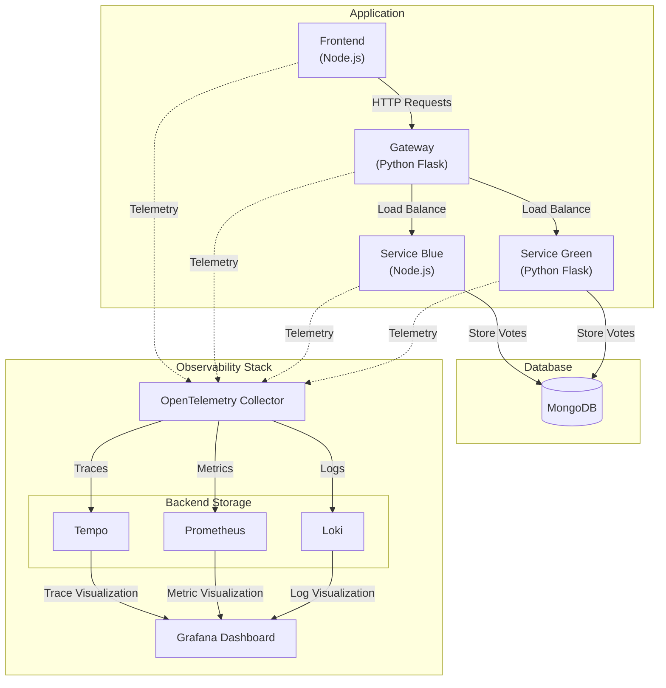

# OpenTelemetry Instrumentation Demo

A demo of OpenTelemetry's capabilities using a simple voting application. This project showcases complete observability implementation including distributed tracing, metrics collection, and log aggregation across multiple services.

This project is part of the LinkedIn Learning course [Mastering Observability with OpenTelemetry](https://www.linkedin.com/learning/mastering-observability-with-opentelemetry).

## Monitoring & Observability

- Services are instrumented with OpenTelemetry.
- Cross-service distributed tracing.
- Traces are collected in Tempo and can be visualized in Grafana and also in Jaeger.
- Metrics are stored in Prometheus.
- Logs are aggregated in Loki.
- The OpenTelemetry Collector handles all telemetry data routing.

## Architecture

The application consists of four services and a complete observability stack.

The following diagram illustrates the architecture of the voting application with OpenTelemetry observability.



### Components

- **Frontend**: Node.js Express service that provides the user interface for voting.
- **Service Gateway**: Python Flask service that acts as an API gateway and load balancer.
- **Service Blue**: Node.js Express service that stores votes into the database.
- **Service Green**: Python Flask service that stores votes into the database.
- **MongoDB**: Database for storing voting data.

### Observability Stack

- **OpenTelemetry Collector**: Collects and processes telemetry data.
- **Tempo**: Distributed tracing system.
- **Prometheus**: Metrics collection and storage.
- **Loki**: Log aggregation system.
- **Grafana**: Visualization platform for all telemetry data.
- **Jaeger**: Another distributed tracing system.

## Running the Demo

### Prerequisites

- Docker and Docker Compose
- Git

### Running the Stack

1. Start all services:

```bash
docker compose up -d
```

2. Access the applications:
   - Frontend Application: <http://localhost:8080>
   - Grafana: <http://localhost:3000>
   - Jaeger UI: <http://localhost:16686>
